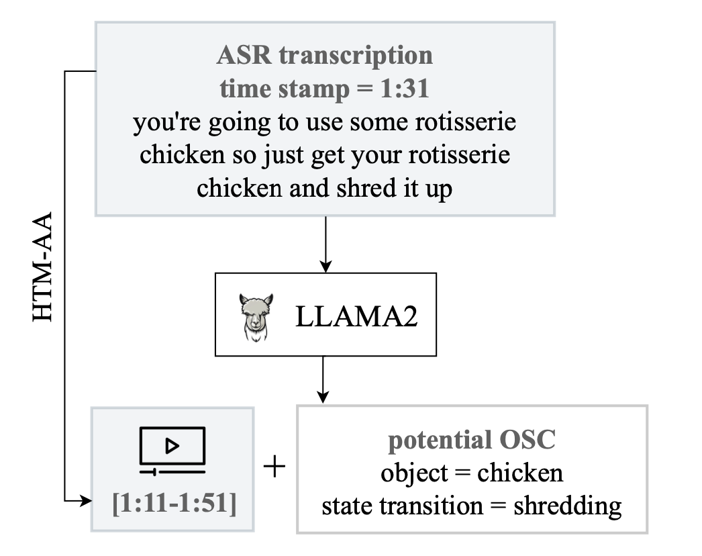

# Learning Object State Changes in Videos: An Open-World Perspective 
[**Learning Object State Changes in Videos: An Open-World Perspective**](https://arxiv.org/abs/2312.11782)                                     
Zihui Xue, Kumar Ashutosh, Kristen Grauman  
CVPR, 2024  
[project page](https://vision.cs.utexas.edu/projects/VidOSC/) | [arxiv](https://arxiv.org/abs/2312.11782) | [bibtex](#citation)

## HowToChange dataset
**HowToChange (Evaluation)**: we collect temporal annotations for 5,423 video clips sourced from HowTo100M, encompassing 409 OSCs (20 state transitions associated with 134 objects). 
<p align="left">
  
</p>

**HowToChange (Pseudo-labeled Train)**: we propose an automated data collection process (paper Section 3.3) and identify 36,075 video clips that may contain OSC, using ASR transcriptions and LLAMA2.
<p align="left">
  
</p>

### Data files
+ See [data_files/osc_split.csv](data_files/osc_split.csv) for the complete list of OSCs and seen/novel splits.  
+ See [data_files/howtochange_eval.csv](data_files/howtochange_eval.csv) for:
  + video clip information (first 4 columns: video name, YouTube id, start time and duration)
  + temporal annotations (middle 3 columns: time ranges for the initial, transistioning and end state of OSC)
  + OSC associated with the clip (last 2 columns: OSC name and whether this is novel OSC)
+ See [data_files/howtochange_unlabeled_train.csv](data_files/howtochange_unlabeled_train.csv) for:
  + video clip information (first 4 columns: video name, YouTube id, start time and duration)
  + OSC associated with the clip (last 2 columns: OSC name and whether this is novel OSC, last column always False since all train OSCs are seen)

### Utils
+ **Clip extraction**: run [data_scripts/preprocess_clip.py](data_scripts/preprocess_clip.py) to extract these clips. Make sure to have [yt-dlp](https://github.com/yt-dlp/yt-dlp) and [ffmpeg](https://ffmpeg.org) installed.  
❗️ Please note that the VidOSC code utilizes pre-processed features, which can be found [here](#before-you-start). This clip extraction step is optional and intended for those interested in visualizing specific video clips. If you require access to the complete HowToChange videos but are experiencing issues with YouTube downloads, please feel free to [email me](mailto:sherryxue@utexas.edu) for a full copy. 

+ **Pseudo label generation**: Run [data_scripts/pseudo_label.py](data_scripts/pseudo_label.py) to pseudo label training clips with CLIP/VideoCLIP. To use VideoCLIP, make sure to have the [MMPT toolkit](https://github.com/facebookresearch/fairseq/tree/main/examples/MMPT) installed.    
🆕❗️[Update July 2024]: We provide preprocessed pseudo labels by VideoCLIP [here](https://drive.google.com/file/d/1YQn7KeRduXeMABBLAP43uNqz8RpOTrI1/view?usp=sharing), where -1=ambiguous, 0=background, 1=initial state, 2=transitioning state, 3=end state.

+ See [data_scripts/read_ann.py](data_scripts/read_ann.py) for helper functions to extract frames and read the annotations.


### Evaluation
+ Run [data_scripts/evaluator.py](data_scripts/evaluator.py), remember to replace `predict()` with your model's prediction function. The evaluator is set as 1fps.

## VidOSC code

### Before you start
1. set up the environment
```bash
conda env create --file environment.yml
conda activate vidosc
```

2. update data path in [train.py](train.py):   

🆕❗️[Update July 2024]: We provide InternVideo (+object-centric) features [here](https://drive.google.com/drive/folders/1tChqwGmfmBWUq0KGFaru2wPB_4Q2hiYP?usp=share_link). Download them and put the two folders under `./data`. `feats_handobj` currently lacks some training files, but is complete for evaluation purposes.

🆕❗️[Update July 2024]: We provide VideoCLIP pseudo labels [here](https://drive.google.com/file/d/1YQn7KeRduXeMABBLAP43uNqz8RpOTrI1/view?usp=sharing). Download and unzip it to the project folder as `./videoclip_pseudolabel`.

`--feat_dir` (default as `./data`): path to InternVideo-MM-L14 features (`feats`) and object-centric InternVideo-MM-L14 features (`feats_handobj`).   
`--pseudolabel_dir` (default as `./videoclip_pseudolabel`): path to pseudo labels (download the pseudo labels above or run [data_scripts/pseudo_label.py](data_scripts/pseudo_label.py) to generate pseudo labels). 

Data Structure:
```
data
  |- feats
  |- feats_handobj
videoclip_pseudolabel
data_files
  |- howtochange_unlabeled_train.csv
  |- howtochange_eval.csv
  |- osc_split.csv
```

### Training
```bash
# Train one model for one state transition
sc_list=("chopping" "slicing" "frying" "peeling" "blending" "roasting" "browning" "grating" "grilling" "crushing" "melting" "squeezing" "sauteing" "shredding" "whipping" "rolling" "mashing" "mincing" "coating" "zesting") 
for sc in ${sc_list[@]}; do
  python train.py --det 0 --sc_list $sc --log_name $sc
done

# Train one multitask model for all state transitions (see paper Table 7)
python train.py --det 0 --sc_list all --log_name multitask
```
 
`--det`: 0: InternVideo features, 1: global InternVideo + object-centric Internvideo features as input (paper Section 3.2).    
`--sc_list`: specify the state transition to train, using `all` trains a multitask model for all state transitions.

### Evaluation
We provide VidOSC checkpoints [here](https://drive.google.com/drive/folders/1QmmYvVag_Z-IEXQebgdz-XhZb9D1_rfX?usp=share_link). Download and put them under `./checkpoints`. 

```bash
# no object-centric feat, use your trained models 
python train.py --det 0 --sc_list $SC_NAME --ckpt ./logs/xxx/xxx.ckpt

# with additional object-centric feat, use provided checkpoints
python train.py --det 1 --sc_list $SC_NAME --ckpt ./checkpoints/$SC_NAME.ckpt

# multi-task evaluation
python train.py --det 0 --sc_list all --ckpt ./checkpoints/multitask.ckpt
```

`--ckpt`: path to the model checkpoint.   
`--sc_list`: specify the state transition to evaluate.


## License
VidOSC is licensed under the [CC-BY-NC license](LICENSE).

## Citation
If you find our work inspiring or use our codebase in your research, please consider giving a star ⭐ and a citation.
```
@inproceedings{xue2024learning,
  title={Learning object state changes in videos: An open-world perspective},
  author={Xue, Zihui and Ashutosh, Kumar and Grauman, Kristen},
  booktitle={Proceedings of the IEEE/CVF Conference on Computer Vision and Pattern Recognition},
  pages={18493--18503},
  year={2024}
}
``` 
