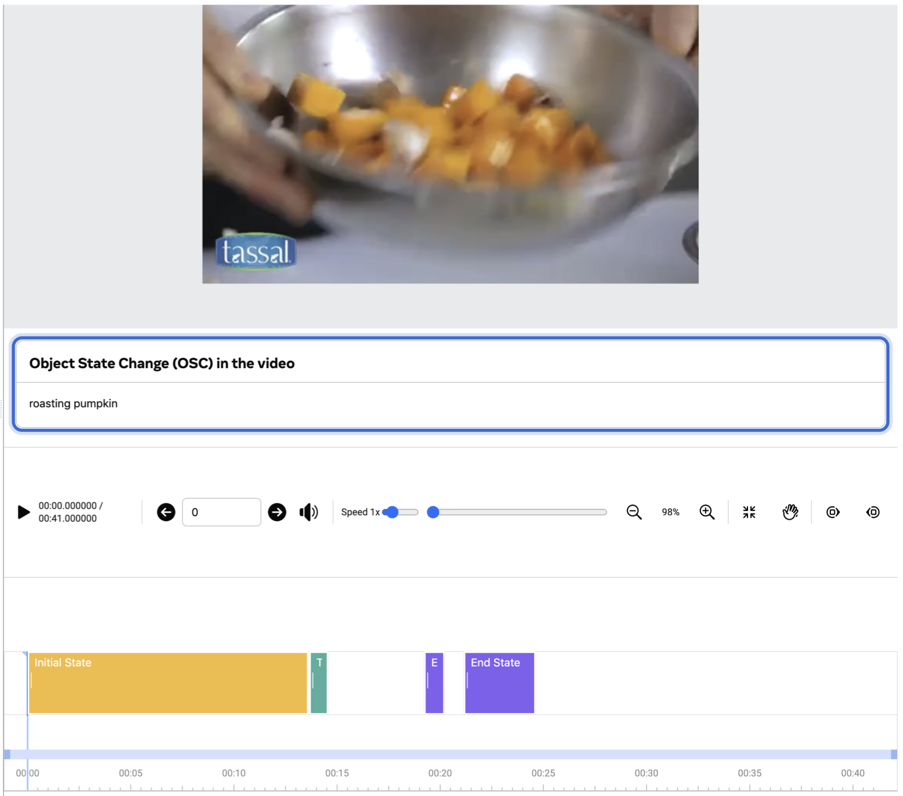

# Learning Object State Changes in Videos: An Open-World Perspective 
[**Learning Object State Changes in Videos: An Open-World Perspective**](https://arxiv.org/abs/2312.11782)                                     
Zihui Xue, Kumar Ashutosh, Kristen Grauman  
arXiv, 2023  
[project page](https://vision.cs.utexas.edu/projects/VidOSC/) | [arxiv](https://arxiv.org/abs/2312.11782) | [bibtex](#citation)

## HowToChange dataset
**HowToChange (Evaluation)**: we collect temporal annotations for 5,423 video clips sourced from HowTo100M, encompassing 409 OSCs (20 state transitions associated with 134 objects). 
<p align="left">
  
</p>

### Data files
+ See [data_files/osc_split.csv](data_files/osc_split.csv) for the complete list of OSCs and seen/novel splits.  
+ See [data_files/howtochange_eval.csv](data_files/howtochange_eval.csv) for:
  + video clip information (first 3 rows, YouTube id, start time and duration)
  + temporal annotations (middle 3 rows, time ranges for the initial, transistioning and end state of OSC)
  + OSC associated with the clip (last 2 rows: OSC name and whether this is novel OSC)

### Utils
+ Run [data_scripts/preprocess_clip.py](data_scripts/preprocess_clip.py) to extract these clips. Make sure to have [yt-dlp](https://github.com/yt-dlp/yt-dlp) and [ffmpeg](https://ffmpeg.org) installed.  
+ See [data_scripts/read_ann.py](data_scripts/read_ann.py) for helper functions to extract frames and read the annotations.


### Evaluation
+ Run [data_scripts/evaluator.py](data_scripts/evaluator.py), remember to replace `predict()` with your model's prediction function. The evaluator is set as 1fps.

## VidOSC code
To be released

## License
EgoT2 is licensed under the [CC-BY-NC license](LICENSE).

## Citation
If you find our work inspiring or use our codebase in your research, please consider giving a star ⭐ and a citation.
```
@article{xue2023learning,
  title={Learning Object State Changes in Videos: An Open-World Perspective},
  author={Xue, Zihui and Ashutosh, Kumar and Grauman, Kristen},
  journal={arXiv preprint arXiv:2312.11782},
  year={2023}
}
``` 